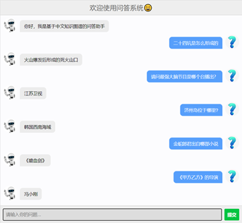

# U-CKGQA-System
Q&A System built by U-CKGQA model

```bash
pip install -r requirements.txt
```

## Run

### 模型训练
首先移步到[https://github.com/xianghuisun/U-CKGQA](https://github.com/xianghuisun/U-CKGQA)仓库下，按照README流程训练模型，保存好检查点

### 启动服务
```bash
python app.py --port 8080
```

修改app.py中如下三个参数
- bart_model_path 下载的BART模型保存的路径
- checkpoint 上一步模型训练后的检查点路径
- kg_path 知识图谱存放的路径

问答系统服务启动地址在本机的ip:8080路由




测试用例：

```bash
二十四坑是怎么形成的
请问最强大脑节目是哪个台播出？
济州岛位于哪里?
金蛇郎君出自哪部小说
《甲方乙方》的导演

姚明的妻子是谁啊
姚明的妻子毕业于哪所学校
明朝的开国皇帝是谁？
明朝的开国皇帝是哪一年去世的？
百度的董事长是谁
百度的董事长毕业于哪所大学？

姚明是哪一年出生的
东北大学是哪一年创办的

我挥一挥衣袖，不带走一片云彩的诗人是谁
世界上最大沙漠是
岳飞的母亲在岳飞的背上刺上哪四个字？
贝多芬的第三交响曲名字是
```